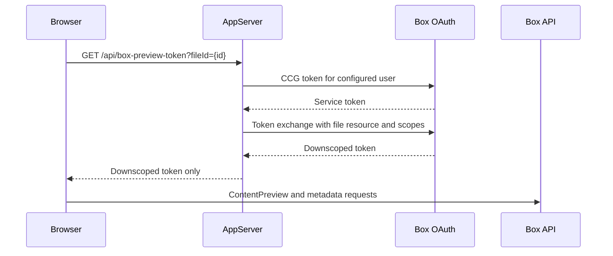
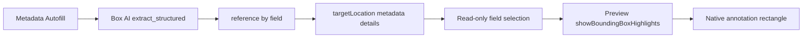

# Box Content Preview HITL Implementation Guide

This guide describes the configuration and application changes required to reproduce the working metadata Autofill, confidence-level, and bounding-box workflow in this repository.

For repository setup, environment variables, and the shortest path to running the example, start with the [README](../README.md). This guide focuses on rebuilding and understanding the integration.

## 🧭 Manual Implementation: Start to Working Experience

Follow these steps in order. Complete the authentication and native Preview integration first, then add the beta compatibility bridges and application shell.

### 🗝️ Legend

- ⚙️ **Configuration**: Box application, environment, permissions, or feature flags; no custom behavior.
- 🔐 **Required authentication integration**: standard Box authentication and token handling required by the integration.
- 📦 **Dependency setup**: pinned npm/runtime versions or package assets.
- ✅ **Native Box behavior**: functionality owned by Box UI Elements, Content Preview, Box AI, or Box Annotations.
- 🚨 **Required custom application code**: integration code every host application must provide.
- 🩹 **Beta workaround**: custom code required by the pinned beta that should be removed after the upstream gap is fixed.
- ⚠️ **Known gap**: supported data or behavior that the native UI does not currently expose.

### 1. ⚙️ Configure the Box application

**[index.ts#L54-L78](https://github.com/unofficialbox/box-content-preview-hitl/blob/main/index.ts#L54-L78)**

Create a Custom App using Client Credentials Grant (CCG), authorize it in the enterprise, and use a Box user that can access the target file and metadata template.

In the Developer Console:

1. Enable CCG.
2. Enable the application scopes needed for files, metadata, Preview, annotations, and Box AI.
3. Add the frontend origin to CORS, for example `http://localhost:3000`.
4. Authorize the app in the Admin Console.

Use a user subject in the server environment:

```sh
cp .env.sample .env
```

Then populate `.env` with the Box app and subject values:

```sh
BOX_CLIENT_ID=
BOX_CLIENT_SECRET=
BOX_ENTERPRISE_ID=
BOX_SUBJECT_TYPE=user
BOX_SUBJECT_ID=<box-user-id>
BOX_PREVIEW_SCOPES="base_preview item_download root_readwrite annotation_edit annotation_view_all ai.readwrite"
```

Keep the client secret and broad CCG token on the server.

### 2. 📦 Install the known-good package versions

**[package.json#L21-L29](https://github.com/unofficialbox/box-content-preview-hitl/blob/main/package.json#L21-L29)**

```sh
bun add box-ui-elements@27.0.0-beta.66 \
  box-annotations@5.2.1-beta.18 \
  react@18.3.1 react-dom@18.3.1 react-intl@6.6.8
```

Import the React component from npm. Do not load `preview.js` from a CDN.

```ts
import BoxAnnotations from "box-annotations";
import ContentPreview from "box-ui-elements/es/elements/content-preview";
```

This Bun project also runs [`scripts/patch-box-ui-elements.mjs`](../scripts/patch-box-ui-elements.mjs) from `postinstall` to repair generated Flow-only modules and a CommonJS React import in the beta dependency graph. Other bundlers may not need this patch.

### 3. 📦 Serve the package CSS from your application

**[src/frontend.tsx#L7-L19](https://github.com/unofficialbox/box-content-preview-hitl/blob/main/src/frontend.tsx#L7-L19)**

Serve the CSS files installed with `box-ui-elements`:

```ts
const previewCss = Bun.file("node_modules/box-ui-elements/dist/preview.css");
const sidebarCss = Bun.file("node_modules/box-ui-elements/dist/sidebar.css");

const cssResponse = (file: Bun.BunFile) => new Response(file, {
  headers: { "content-type": "text/css; charset=utf-8" },
});

// Bun.serve routes
"/box-ui-elements/preview.css": () => cssResponse(previewCss),
"/box-ui-elements/sidebar.css": () => cssResponse(sidebarCss),
```

Load those styles before mounting React:

```ts
for (const href of [
  "/box-ui-elements/preview.css",
  "/box-ui-elements/sidebar.css",
]) {
  const link = document.createElement("link");
  link.rel = "stylesheet";
  link.href = href;
  document.head.append(link);
}
```

### 4. 🔐 Implement CCG and token exchange on the server

**[index.ts#L35-L105](https://github.com/unofficialbox/box-content-preview-hitl/blob/main/index.ts#L35-L105)**

First request a CCG service token for the configured user. Exchange it for a token restricted to one file and the required scopes.

```ts
const serviceToken = await requestBoxToken(new URLSearchParams({
  box_subject_id: process.env.BOX_SUBJECT_ID!,
  box_subject_type: "user",
  client_id: process.env.BOX_CLIENT_ID!,
  client_secret: process.env.BOX_CLIENT_SECRET!,
  grant_type: "client_credentials",
}));

const previewToken = await requestBoxToken(new URLSearchParams({
  grant_type: "urn:ietf:params:oauth:grant-type:token-exchange",
  resource: `https://api.box.com/2.0/files/${fileId}`,
  scope: process.env.BOX_PREVIEW_SCOPES!,
  subject_token: serviceToken.access_token,
  subject_token_type: "urn:ietf:params:oauth:token-type:access_token",
}));
```

Expose a same-origin endpoint that returns only the downscoped token:

```ts
GET /api/box-preview-token?fileId={fileId}

{
  "accessToken": "<downscoped-token>",
  "expiresIn": 3600,
  "fileId": "2056558550295",
  "tokenType": "bearer"
}
```

### 5. 🔐 Fetch the downscoped token in React

**[src/components/hitl/HitlPreviewExample.tsx#L197-L235](https://github.com/unofficialbox/box-content-preview-hitl/blob/main/src/components/hitl/HitlPreviewExample.tsx#L197-L235)**

```ts
const [token, setToken] = useState("");

useEffect(() => {
  void fetch(`/api/box-preview-token?fileId=${encodeURIComponent(fileId)}`)
    .then((response) => response.json())
    .then((payload) => setToken(payload.accessToken));
}, [fileId]);

const getToken = useCallback(async () => token, [token]);
```

Pass an async function to `ContentPreview`. Preview `3.59.0` requires a token function for its annotation integration.

### 6. ⚙️ Configure the HITL features

**[src/components/hitl/HitlPreviewExample.tsx#L19-L34](https://github.com/unofficialbox/box-content-preview-hitl/blob/main/src/components/hitl/HitlPreviewExample.tsx#L19-L34)**

Keep the flags in state if users should be able to toggle them:

```ts
const [features, setFeatures] = useState({
  "metadata.aiSuggestions.enabled": true,
  "metadata.betaLanguage.enabled": true,
  "metadata.boundingBox.enabled": true,
  "metadata.confidenceScore.enabled": true,
  "metadata.redesign.enabled": true,
});
```

Pass the same object to both `ContentPreview.features` and `contentSidebarProps.features`.

### 7. ✅ Render Content Preview and default to Metadata

**[src/components/hitl/HitlPreviewExample.tsx#L371-L440](https://github.com/unofficialbox/box-content-preview-hitl/blob/main/src/components/hitl/HitlPreviewExample.tsx#L371-L440)**

```tsx
const boxAnnotations = new BoxAnnotations({});

<IntlProvider locale="en">
  <ContentPreview
    apiHost="https://api.box.com"
    appHost="https://app.box.com"
    boxAnnotations={boxAnnotations}
    contentSidebarProps={{
      defaultView: "metadata",
      features,
      hasActivityFeed: true,
      hasDetails: true,
      hasMetadata: true,
      metadataSidebarProps: {
        onError: handleMetadataError,
        onSuccess: handleMetadataSuccess,
      },
    }}
    enableBoundingBoxHighlights={features["metadata.boundingBox.enabled"]}
    enableModernizedComponents
    enableThumbnailsSidebar
    features={features}
    fileId={fileId}
    hasHeader
    initialEntries={["/metadata"]}
    previewLibraryVersion="3.59.0"
    requestInterceptor={handleBoxUiRequest}
    responseInterceptor={handleBoxUiResponse}
    showAnnotations
    token={getToken}
  />
</IntlProvider>
```

Both `defaultView` and the router-level `initialEntries` are needed in this package version. Without `initialEntries`, the outer Preview router opens Activity first.

### 8. 🩹 Retain Box AI references and confidence scores

**[src/components/hitl/HitlPreviewExample.tsx#L274-L295](https://github.com/unofficialbox/box-content-preview-hitl/blob/main/src/components/hitl/HitlPreviewExample.tsx#L274-L295)**

Use `responseInterceptor` to retain the structured extraction response:

```ts
const handleBoxUiResponse = (response: BoxUiResponse) => {
  if (response.config?.url?.includes("/ai/extract_structured")) {
    referencesByFieldRef.current = response.data?.reference ?? {};
    confidenceScoresByFieldRef.current = response.data?.confidence_score ?? {};
  }

  return response;
};
```

Convert Box AI normalized bounding boxes to the percentage coordinates expected by Preview:

```ts
const box = {
  id: `bbox-${fieldKey}-${index + 1}`,
  x: left * 100 - 0.25,
  y: top * 100 - 0.25,
  width: (right - left) * 100 + 0.5,
  height: (bottom - top) * 100 + 0.5,
  pageNumber: page + 1,
};
```

The complete normalization, detailed-metadata hydration, and session fallback are in [`HitlPreviewExample.tsx`](../src/components/hitl/HitlPreviewExample.tsx).

### 9. 🩹 Bridge metadata selection to native Preview boxes

**[src/components/hitl/HitlPreviewExample.tsx#L326-L340](https://github.com/unofficialbox/box-content-preview-hitl/blob/main/src/components/hitl/HitlPreviewExample.tsx#L326-L340)**

The host does not draw rectangles. It calls Preview's public API with the retained coordinates:

```ts
const preview = contentPreviewRef.current?.getPreview();

if (boxes.length && preview?.showBoundingBoxHighlights) {
  preview.showBoundingBoxHighlights(boxes);
}
```

Attach this to focus and click events around `ContentPreview`, resolve the metadata field label, and look up its boxes. Native Preview then owns drawing, zoom, scrolling, resize, and annotation mode.

### 10. 🩹 Repair the beta metadata save patch

**[src/components/hitl/HitlPreviewExample.tsx#L297-L324](https://github.com/unofficialbox/box-content-preview-hitl/blob/main/src/components/hitl/HitlPreviewExample.tsx#L297-L324)**

This beta can omit the HITL details when it builds the metadata JSON Patch. In `requestInterceptor`, add the missing operations before returning the request:

```ts
operations.push(
  { op: "add", path: `${path}/process`, value: "AI_EXTRACTED" },
  {
    op: "add",
    path: `${path}/targetLocation`,
    value: JSON.stringify(references),
  },
  { op: "add", path: `${path}/confidenceScore`, value: confidence.score },
  { op: "add", path: `${path}/confidenceLevel`, value: confidence.level },
);
```

Guard against duplicate paths. Remove this workaround after confirming a future UI Elements version creates these operations itself.

### 11. 🚨 Add numeric confidence percentages

**[src/components/hitl/HitlPreviewExample.tsx#L237-L272](https://github.com/unofficialbox/box-content-preview-hitl/blob/main/src/components/hitl/HitlPreviewExample.tsx#L237-L272)**

The native sidebar exposes review states but does not render the raw percentage required by this experience. Add a data attribute to each matching metadata heading:

```ts
heading.dataset.hitlConfidence = `${confidence.percentage}%`;
heading.dataset.hitlConfidenceLevel = confidence.level;
heading.setAttribute(
  "aria-label",
  `${label}, ${confidence.percentage}% confidence`,
);
```

Render the pill with CSS:

```css
.hitl-content-preview h5[data-hitl-confidence]::after {
  content: attr(data-hitl-confidence);
  padding: 1px 7px;
  font-size: 0.6875rem;
  font-weight: 700;
  background: #e8f8ef;
  border: 1px solid #9ed8b5;
  border-radius: 999px;
}
```

Use a `MutationObserver` because the metadata sidebar renders and rerenders inside UI Elements after network responses and navigation.

### 12. 🚨 Build the host application shell

**[src/components/hitl/HitlPreviewExample.tsx#L342-L547](https://github.com/unofficialbox/box-content-preview-hitl/blob/main/src/components/hitl/HitlPreviewExample.tsx#L342-L547)**

The shell in this repository is custom application UI, not Box UI Elements behavior:

- A `300px` collapsible configuration sidebar contains File ID, authentication status, and feature switches.
- Closing configuration expands Preview to the full content width and hides the event terminal.
- Preview has a fixed `650px` height.
- The event terminal is sticky at the bottom while configuration is open.
- Preview events are stored in a bounded in-memory list; never log tokens.

Core layout CSS:

```css
.hitl-workspace {
  display: grid;
  grid-template-columns: minmax(0, 1fr) 300px;
  gap: 16px;
}

.hitl-workspace--settings-closed {
  grid-template-columns: minmax(0, 1fr);
}

.hitl-preview-shell {
  height: 650px;
  min-height: 650px;
  overflow: hidden;
}

.hitl-terminal {
  position: sticky;
  z-index: 4;
  bottom: 0;
}
```

Render the terminal only when configuration is open:

```tsx
{isSettingsOpen ? <PreviewEventTerminal events={events} /> : null}
```

### 13. ✅ Verify the complete flow

**[package.json#L6-L11](https://github.com/unofficialbox/box-content-preview-hitl/blob/main/package.json#L6-L11)**

```sh
PORT=3000 bun run dev
bun run build:dev
bun run build
```

Then verify manually:

1. The token endpoint returns HTTP 200 and only a downscoped token.
2. Preview opens the real file and Metadata is selected by default.
3. Autofill returns values, references, and confidence scores.
4. Selecting a metadata field draws a native `.ba-BoundingBoxHighlightRect`.
5. The box stays aligned while zooming and scrolling.
6. Saving metadata returns HTTP 200 and persists `targetLocation`, `process`, and confidence details.
7. A fresh browser session highlights saved fields without rerunning Autofill.
8. Closing configuration expands Preview and removes the event terminal.
9. With configuration open, the terminal remains pinned while the main pane scrolls.

## 🧾 Change Matrix

| Type | Change needed | Where | Permanent? | Why |
| --- | --- | --- | --- | --- |
| ⚙️ Configuration | Enable and authorize a CCG Box Custom App | Box Developer Console and Admin Console | Yes | Allows the server to authenticate without exposing credentials to the browser. |
| ⚙️ Configuration | Use a user CCG subject with access to the file and template | `.env` and Box collaborations | Yes | Preview, Box AI, and metadata permissions are evaluated for this user. |
| ⚙️ Configuration | Add the frontend origin to the CORS allowlist | Box Developer Console | Yes | Allows browser requests from the application origin. |
| ⚙️ Configuration | Downscope to the file with Preview, metadata, annotation, and AI scopes | Server token route | Yes | Limits the browser token while enabling the complete workflow. |
| 📦 Dependency setup | Pin `box-ui-elements@27.0.0-beta.66` | `package.json` | Until upgraded | Provides the HITL metadata redesign and feature flags used here. |
| 📦 Dependency setup | Pin Content Preview `3.59.0` | `previewLibraryVersion` | Until upgraded | Provides the public bounding-box methods used by the integration. |
| 📦 Dependency setup | Install `box-annotations@5.2.1-beta.18` | `package.json` and `boxAnnotations` prop | 🩹 Beta-only | The annotation runtime bundled with Preview 3.59 lacks bounding-box rendering methods. |
| 📦 Dependency setup | Serve `preview.css` and `sidebar.css` from the installed package | Server routes and frontend bootstrap | Yes | Ensures Preview and Sidebar use matching package styles without a package CDN. |
| 🔐 Required authentication integration | Implement the server-side CCG and token-exchange endpoint | `index.ts` | Yes | Keeps the client secret and broad service token on the server. |
| 🔐 Required authentication integration | Pass the downscoped token as an async function | `HitlPreviewExample.tsx` | Version-dependent | Preview 3.59 requires a function for `annotatorToken`. |
| ⚙️ Configuration | Enable metadata redesign, Autofill, bbox, and confidence feature flags | `features` and `contentSidebarProps.features` | Yes | Activates the native HITL metadata workflow. |
| ✅ Native Box behavior | Run structured extraction with references and confidence scores | Metadata Autofill | Yes | Box AI returns values, `reference`, and `confidence_score`. |
| ✅ Native Box behavior | Render, scroll, select, resize, and zoom bounding boxes | Content Preview and Box Annotations | Yes | The host should not draw its own rectangle overlay. |
| 🚨 Required custom application code | Put metadata callbacks under `metadataSidebarProps` | `contentSidebarProps.metadataSidebarProps` | Yes for this beta API | Prevents a successful metadata update from surfacing as a client error. |
| 🩹 Beta workaround | Retain Autofill references in `responseInterceptor` | `HitlPreviewExample.tsx` | No | This beta does not forward unsaved references to field selection reliably. |
| 🩹 Beta workaround | Bridge metadata field selection to `showBoundingBoxHighlights()` | `HitlPreviewExample.tsx` | No | Enables immediate edit/read-only selection before native state catches up. |
| 🩹 Beta workaround | Restore `process` and `targetLocation` JSON Patch operations | `requestInterceptor` | No | This beta drops those operations while generating the save request. |
| 🩹 Beta workaround | Cache converted boxes in session storage per file | `HitlPreviewExample.tsx` | No | Preserves unsaved session highlighting across navigation or reload. |
| 🚨 Required custom application code | Display numeric confidence percentages beside metadata keys | `HitlPreviewExample.tsx` and `app-layout.css` | Product requirement | Native UI exposes qualitative confidence only, so the host presents Box AI's numeric score as an accessible percentage pill. |

### 🧩 Ownership Summary

| Responsibility | Owner |
| --- | --- |
| Credentials, CCG subject, CORS, scopes, and feature flags | ⚙️ Application/Box configuration |
| CCG token endpoint and downscoped token delivery | 🔐 Standard Box authentication integration |
| React composition, callbacks, and package asset routes | 🚨 Host application |
| Extraction values, references, and confidence data | ✅ Box AI |
| Metadata form, Autofill controls, and read-only field selection | ✅ Box UI Elements |
| Rectangle rendering and zoom/scroll synchronization | ✅ Content Preview and Box Annotations |
| Reference retention and save-patch repair in this pinned beta | 🩹 Temporary host workarounds |
| Numeric confidence percentage pills | 🚨 Host application presentation |

## 📌 Known-Good Versions

Pin these versions together. Later or earlier combinations may change the Preview/Annotations contract.

```json
{
  "box-annotations": "5.2.1-beta.18",
  "box-ui-elements": "27.0.0-beta.66",
  "react": "18.3.1",
  "react-dom": "18.3.1",
  "react-intl": "6.6.8"
}
```

Pin Box Content Preview at runtime:

```ts
const previewLibraryVersion = "3.59.0";
```

## ⚙️ Box Application Configuration

Configure a Custom App using Client Credentials Grant (CCG):

1. Enable CCG authentication.
2. Authorize the application in the enterprise.
3. Use a Box user as the CCG subject when the content and Box AI permissions belong to that user.
4. Grant the application scopes needed for Preview, metadata updates, annotations, and Box AI.
5. Add every frontend origin to the application's CORS allowlist, including `http://localhost:3000` for this example.
6. Confirm the subject user can access the file and metadata template.

Environment variables used here:

```sh
BOX_CLIENT_ID=
BOX_CLIENT_SECRET=
BOX_ENTERPRISE_ID=<enterprise-id>
BOX_SUBJECT_TYPE=user
BOX_SUBJECT_ID=<box-user-id>
BOX_PREVIEW_SCOPES="base_preview item_download root_readwrite annotation_edit annotation_view_all ai.readwrite"
```

Do not expose `BOX_CLIENT_SECRET` or the broad CCG service token to the browser.

## 🔐 Authentication Flow



The token exchange must use the file as its resource:

```ts
new URLSearchParams({
  grant_type: "urn:ietf:params:oauth:grant-type:token-exchange",
  resource: `https://api.box.com/2.0/files/${fileId}`,
  scope: "base_preview item_download root_readwrite annotation_edit annotation_view_all ai.readwrite",
  subject_token: serviceToken.access_token,
  subject_token_type: "urn:ietf:params:oauth:token-type:access_token",
});
```

`ai.readwrite` is required for `POST /2.0/ai/extract_structured`. `root_readwrite` is required here because the workflow updates metadata.

## 📦 Package Assets

Import the React component from npm. Do not load `preview.js` yourself.

```ts
import ContentPreview from "box-ui-elements/es/elements/content-preview";
```

Serve the installed UI Elements styles from the application origin:

```text
/box-ui-elements/preview.css -> node_modules/box-ui-elements/dist/preview.css
/box-ui-elements/sidebar.css -> node_modules/box-ui-elements/dist/sidebar.css
```

Load both styles before rendering `ContentPreview`. Do not use jsdelivr or another package CDN for these files.

## ✅ ContentPreview Configuration

Enable the metadata redesign and HITL features:

```ts
const hitlFeatures = {
  "metadata.aiSuggestions.enabled": true,
  "metadata.betaLanguage.enabled": true,
  "metadata.boundingBox.enabled": true,
  "metadata.confidenceScore.enabled": true,
  "metadata.redesign.enabled": true,
};
```

Supply the token as a function. Preview 3.59 rejects a string `annotatorToken`.

```ts
const getToken = useCallback(async () => token, [token]);
```

Use the newer npm annotation runtime because the annotation bundle served with Preview 3.59 does not implement `setBoundingBoxHighlights()`:

```ts
import BoxAnnotations from "box-annotations";

const boxAnnotations = new BoxAnnotations({});
```

Minimum relevant props:

```tsx
<ContentPreview
  apiHost="https://api.box.com"
  appHost="https://app.box.com"
  boxAnnotations={boxAnnotations}
  enableBoundingBoxHighlights
  enableModernizedComponents
  features={hitlFeatures}
  fileId={fileId}
  previewLibraryVersion="3.59.0"
  showAnnotations
  token={getToken}
/>
```

To enable the full example, also set `enableThumbnailsSidebar`, `hasHeader`, Activity Feed, Metadata, Details, and Box AI Content Answers as shown in `HitlPreviewExample.tsx`.

## 🚨 Metadata Sidebar Callbacks

The redesigned metadata sidebar expects its callbacks under `metadataSidebarProps`, not at the parent sidebar level:

```tsx
contentSidebarProps={{
  hasMetadata: true,
  metadataSidebarProps: {
    onError: handleMetadataError,
    onSuccess: handleMetadataSuccess,
  },
}}
```

If these callbacks are omitted in this beta, Box may return HTTP 200 while the UI displays the generic metadata update error because the client throws after the successful response.

## ✅ Bounding-Box Data Flow



Box AI references use normalized coordinates:

```ts
{
  itemId: "2056558550295",
  page: 0,
  text: "9834562",
  boundingBox: { left: 0.266, top: 0.071, right: 0.340, bottom: 0.086 },
}
```

Preview expects percentage coordinates and a one-based page number. The conversion used by Box UI Elements adds a small padding:

```ts
{
  id: `bbox-${fieldKey}-${index + 1}`,
  x: left * 100 - 0.25,
  y: top * 100 - 0.25,
  width: (right - left) * 100 + 0.5,
  height: (bottom - top) * 100 + 0.5,
  pageNumber: page + 1,
}
```

Preview owns drawing, scrolling, selection, resize, and zoom behavior. Do not add an application-owned rectangle overlay.

## 🩹 Compatibility Bridges Required by This Beta

These are workarounds for the pinned beta, not general Box platform requirements:

1. `responseInterceptor` retains Autofill `reference` data for immediate edit/read-only selection.
2. A small field-selection bridge calls Preview's public `showBoundingBoxHighlights()` method when unsaved references are not forwarded by the metadata editor.
3. `requestInterceptor` restores the package-defined JSON Patch operations dropped by this beta:

```json
[
  { "op": "add", "path": "/invoiceNumber/process", "value": "AI_EXTRACTED" },
  {
    "op": "add",
    "path": "/invoiceNumber/targetLocation",
    "value": "[{...serialized Box AI references...}]"
  }
]
```

4. A session-storage fallback caches only converted rectangle coordinates per file. It stores no token, metadata value, or document text.
5. The same save bridge persists `confidenceScore` and `confidenceLevel` operations returned by Box AI.

Once Box UI Elements forwards unsaved references and generates these patch operations correctly, remove these bridges and rely on its native `useMetadataFieldSelection` path.

## 🚨 Confidence Scores

With `metadata.confidenceScore.enabled`, Autofill sends `include_confidence_score=true`. The native UI displays qualitative states such as high or low confidence and a low-confidence review indicator.

This application additionally reads `response.confidence_score`, uses the lowest score when Box returns multiple scores for one field, converts values from `0..1` to a rounded percentage, and displays an accessible pill beside the read-only metadata key. High, medium, and low levels use green, amber, and red styling. After save, the display hydrates from Box's `metadata?view=detailed` response in new browser sessions. The normalized display scores are cached per file for the active browser session; tokens, metadata values, and document text are not stored.

## ✅ Verification

1. Start the app and open the HITL screen.
2. Confirm Preview renders the real file.
3. Open Metadata and run Autofill.
4. Click an extracted field and confirm `.ba-BoundingBoxHighlightRect` exists.
5. Zoom in and out; confirm the rectangle dimensions and position update.
6. Save Autofill and confirm the metadata update returns HTTP 200 without an error banner.
7. Open a fresh browser tab or session.
8. Click a read-only metadata field without entering Edit mode; confirm its persisted bounding box appears.

Build verification:

```sh
bun run build
bun run build:dev
```

## 🛠️ Troubleshooting

| Symptom | Check |
| --- | --- |
| Token endpoint returns 500 | CCG credentials, user subject, enterprise authorization, and restarted server after `.env` changes |
| Browser receives 403 | File access, downscoped resource, required scopes, and Box AI authorization |
| Preview spins indefinitely | CORS allowlist, token function, Preview version, and loaded package CSS |
| `Bad annotatorToken!` | Pass `token` as an async function, not a string |
| Public bbox API exists but draws nothing | Supply `box-annotations@5.2.1-beta.18` through `boxAnnotations` |
| Autofill returns values but no boxes | Confirm `include_reference=true` and coordinate-bearing `reference` entries |
| Save sends `[]` | Restore `process` and `targetLocation` operations or upgrade past the affected UI Elements beta |
| Box returns 200 but UI shows update error | Put `onSuccess` and `onError` under `contentSidebarProps.metadataSidebarProps` |
| Boxes disappear after reload | Persist `targetLocation` or use the documented session fallback |

## 📚 Reference Files

- `index.ts`: CCG, downscoping, and local CSS routes.
- `src/frontend.tsx`: local package stylesheet loading.
- `src/components/hitl/HitlPreviewExample.tsx`: complete React integration and compatibility bridges.
- `scripts/patch-box-ui-elements.mjs`: Bun compatibility patch applied after install.
- `HITL_HANDOFF.md`: current repository state and verification history.
